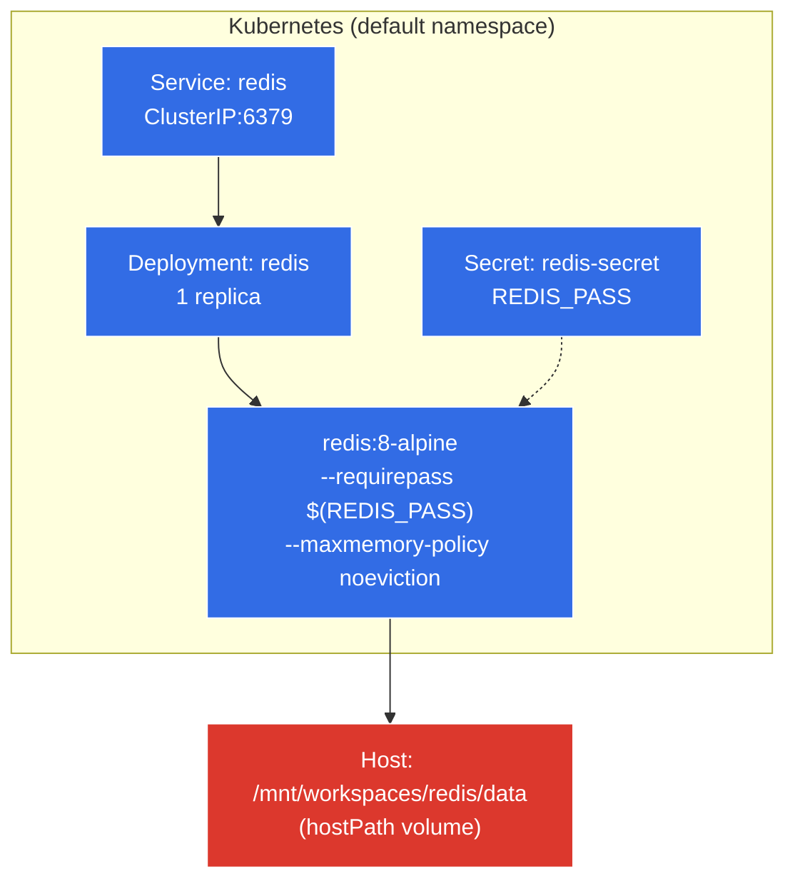

<h1 align="center">Redis</h1>
<p align="center">
  <strong>Standalone Redis 8 in Kubernetes</strong>
  <br />
  <em>Backed by hostPath persistence · Password-protected · noeviction policy</em>
</p>

<p align="center">
  <a href="#quick-start"></a>
  <a href="LICENSE"></a>
</p>

<p align="center">
  
  
  
</p>

<!-- AUTO-GENERATED -->

## Features

- **Password authentication** — `--requirepass` via Kubernetes Secret, never hardcoded in manifests
- **Persistent storage** — `hostPath` volume mounted at `/data`; survives pod restarts
- **Data protection** — `noeviction` policy rejects writes when memory limit (256Mi) is reached instead of dropping keys
- **Single replica** — minimal deployment for local development; no clustering overhead

## Quick Start

```bash
kubectl apply -f k8s/redis-secret.yaml          # first — Deployment references it
kubectl apply -f k8s/redis-deployment.yaml       # creates Service + Deployment
```

## Usage

```bash
POD=$(kubectl get pod -l app=redis -o jsonpath='{.items[0].metadata.name}')
kubectl exec "$POD" -- redis-cli -a "$REDIS_PASS" PING
kubectl exec "$POD" -- redis-cli -a "$REDIS_PASS" INFO MEMORY
```

Reset persistence:
```bash
kubectl delete pod "$POD"                         # pod recreates, hostPath remounts
```

## Architecture



## Configuration

| Setting | Value | Source |
|---|---|---|
| Image | `redis:8-alpine` | `redis-deployment.yaml` |
| Namespace | `default` | `redis-deployment.yaml` |
| Replicas | 1 | `redis-deployment.yaml` |
| Service | `ClusterIP` port 6379 | `redis-deployment.yaml` |
| Memory limit | 256Mi | `redis-deployment.yaml` |
| CPU limit | 500m | `redis-deployment.yaml` |
| Storage | `hostPath` `/mnt/workspaces/redis/data` | `redis-deployment.yaml` |
| Password | Injected from `redis-secret` | `k8s/redis-secret.yaml` (gitignored) |

## Directory Structure

```
├── AGENTS.md              # Agent instructions & diagnostics
├── data/                  # Persistent data (gitignored)
└── k8s/
    ├── redis-deployment.yaml   # Service + Deployment
    └── redis-secret.yaml       # Secret (gitignored)
```

## Deployment

Apply manifests in order. The Secret must exist before the Deployment starts, since the container command references `$(REDIS_PASS)` at launch:

```bash
kubectl apply -f k8s/redis-secret.yaml
kubectl apply -f k8s/redis-deployment.yaml
```

No `livenessProbe` or `readinessProbe` is configured — the pod reports ready as soon as the container starts. No PodDisruptionBudget; a rolling restart may briefly evict in-flight traffic.

## Contributing

1. Fork the repository
2. Create a feature branch (`git checkout -b feature/improvement`)
3. Commit changes (`git commit -m 'Add improvement'`)
4. Push and open a pull request

Licensed under [MIT](LICENSE).

<!-- BEAUTIFIED -->